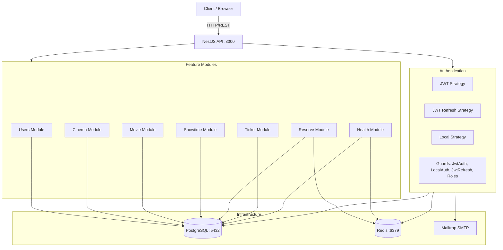
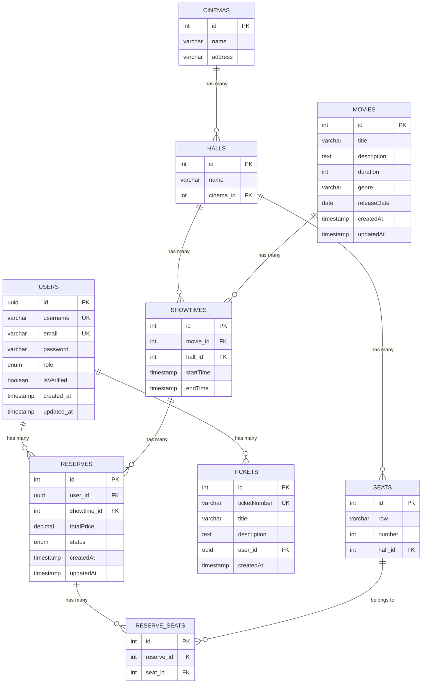
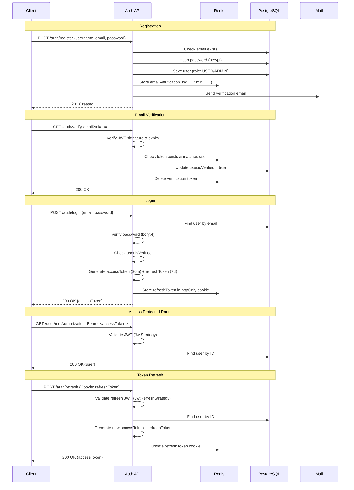
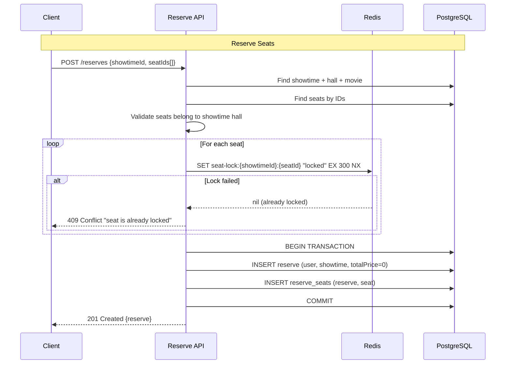

# Cinema Ticket System

A robust NestJS-based cinema ticket reservation system with seat locking, JWT authentication, and role-based access control.

## Tech Stack

- **Framework**: NestJS 11 + TypeScript
- **Database**: PostgreSQL 17 (TypeORM)
- **Cache/Locks**: Redis 7 (ioredis)
- **Auth**: JWT (access + refresh tokens), bcrypt, Passport
- **Email**: Nodemailer + MailerModule (Mailtrap)
- **API Docs**: Swagger/OpenAPI 3
- **Validation**: class-validator + class-transformer
- **Rate Limiting**: @nestjs/throttler with Redis storage

---

## Architecture Overview



---

## Entity Relationship Diagram



---

## Authentication Flow



---

## Seat Reservation Flow



---

## Prerequisites

- **Node.js** 22+
- **Docker** & **Docker Compose**
- **PostgreSQL** 17 (via Docker)
- **Redis** 7 (via Docker)

> **⚠️ IMPORTANT**: Redis **must** be running before starting the application. The API uses Redis for:
> - Refresh token storage (httpOnly cookies)
> - Rate limiting (ThrottlerModule)
> - Seat locking (5-minute distributed locks)
> - Email verification token storage

---

## Quick Start (Docker)

```bash
# 1. Clone and enter project
cd ticket-system

# 2. Copy environment files
cp .env.example .env          # for local development
cp .env.docker.example .env.docker  # for Docker

# 3. Start PostgreSQL + Redis
docker-compose up -d postgres redis

# 4. Wait for databases to be healthy (~5-10s)
docker-compose ps

# 5. Install dependencies
npm install

# 6. Run database migrations ⚠️ REQUIRED
npm run migration:run

# 7. Start development server
npm run start:dev
```

The API will be available at:
- **API**: http://localhost:3000
- **Swagger Docs**: http://localhost:3000/api
- **Health Check**: http://localhost:3000/health

---

## Full Docker Stack

```bash
# Build and start all services (API + Postgres + Redis)
docker-compose up -d --build

# View logs
docker-compose logs -f api

# Stop all
docker-compose down

# Stop and remove volumes (⚠️ deletes DB data)
docker-compose down -v
```

---

## Environment Variables

| Variable | Description | Default |
|----------|-------------|---------|
| `PORT` | API port | `3000` |
| `DATABASE_HOST` | Postgres host | `localhost` |
| `DATABASE_PORT` | Postgres port | `5432` |
| `DATABASE_USER` | Postgres user | `postgres` |
| `DATABASE_PASSWORD` | Postgres password | — |
| `DATABASE_NAME` | Database name | `ticket` |
| `JWT_ACCESS_TOKEN` | Access token secret | — |
| `JWT_REFRESH_TOKEN` | Refresh token secret | — |
| `JWT_ACCESS_TOKEN_TTL` | Access token TTL | `30m` |
| `JWT_REFRESH_TOKEN_TTL` | Refresh token TTL | `7d` |
| `JWT_EMAIL_VERIFICATION_TOKEN` | Email verification secret | — |
| `MAIL_HOST` | SMTP host | `sandbox.smtp.mailtrap.io` |
| `SMTP_USERNAME` | SMTP username | — |
| `SMTP_PASSWORD` | SMTP password | — |
| `REDIS_HOST` | Redis host | `localhost` |
| `REDIS_PORT` | Redis port | `6379` |

---

## Database Migrations

```bash
# Generate new migration (after entity changes)
npm run migration:generate -- -n MigrationName

# Run pending migrations
npm run migration:run

# Revert last migration
npm run migration:revert

# Show migration status
npm run migration:show
```

> **⚠️ CRITICAL**: Always run `npm run migration:run` after:
> - Fresh database setup
> - Pulling changes with new migrations
> - Switching branches with schema changes

---

## API Endpoints

| Module | Endpoints |
|--------|-----------|
| **Auth** | `POST /auth/register`, `GET /auth/verify-email`, `POST /auth/login`, `POST /auth/refresh`, `POST /auth/logout` |
| **Users** | `GET /user/me`, `PATCH /user/update`, `PATCH /user/updatePass`, `DELETE /user/delete`, `GET /user/users` (Admin), `GET /user/pagination` |
| **Cinema** | `POST /cinema/create`, `GET /cinema/getAll`, `GET /cinema/:id`, `PATCH /cinema/:id`, `DELETE /cinema/:id` |
| **Hall** | `POST /hall/create/:cinemaId`, `GET /hall/cinema/:cinemaId`, `GET /hall/:id`, `PATCH /hall/:id`, `DELETE /hall/:id` |
| **Seat** | `POST /seat/hall/:hallId`, `GET /seat/hall/:hallId`, `GET /seat/:id` |
| **Movies** | `POST /movies`, `GET /movies`, `GET /movies/:id`, `PATCH /movies/:id`, `DELETE /movies/:id` |
| **Showtimes** | `POST /showtimes`, `GET /showtimes/:id`, `PATCH /showtimes/:id`, `DELETE /showtimes/:id` |
| **Reserves** | `POST /reserves`, `GET /reserves/:id`, `DELETE /reserves/:id`, `POST /reserves/lock-seat` |
| **Tickets** | `POST /ticket/create`, `GET /ticket/all` (Admin), `GET /ticket/:id`, `DELETE /ticket/:id` |
| **Health** | `GET /health` |

---

## Role-Based Access

| Role | Permissions |
|------|-------------|
| **USER** | Own profile, create reserves/tickets, view own data |
| **ADMIN** | All USER + manage users/cinemas/halls/seats/movies/showtimes, view all tickets/reserves |

Admin emails are whitelisted in `src/auth/providers/whiteList.provider.ts`.

---

## Testing

```bash
# Unit tests
npm run test

# Watch mode
npm run test:watch

# Coverage
npm run test:cov

# E2E tests
npm run test:e2e
```

---

## Project Structure

```
src/
├── auth/           # Authentication (JWT, guards, strategies)
├── cinema/         # Cinema, Hall, Seat management
├── common/         # Guards, decorators
├── config/         # Configuration (JWT, Redis, Mail, TypeORM, Env validation)
├── database/       # TypeORM DataSource & migrations
├── health/         # Health checks (DB + Redis)
├── mail/           # Email service (welcome/verification)
├── movie/          # Movie CRUD
├── redis/          # Redis client provider
├── reserve/        # Seat reservation + Redis locking
├── showtime/       # Showtime CRUD
├── ticket/         # Support ticket system
├── users/          # User management
├── app.module.ts   # Root module
└── main.ts         # Bootstrap + Swagger setup
```

---

## License

UNLICENSED — Private project.